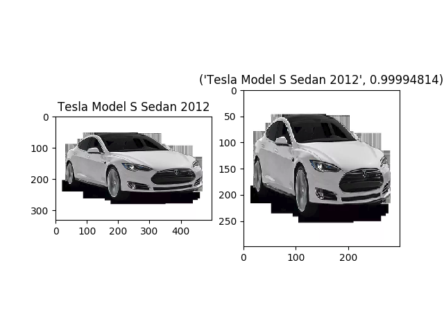
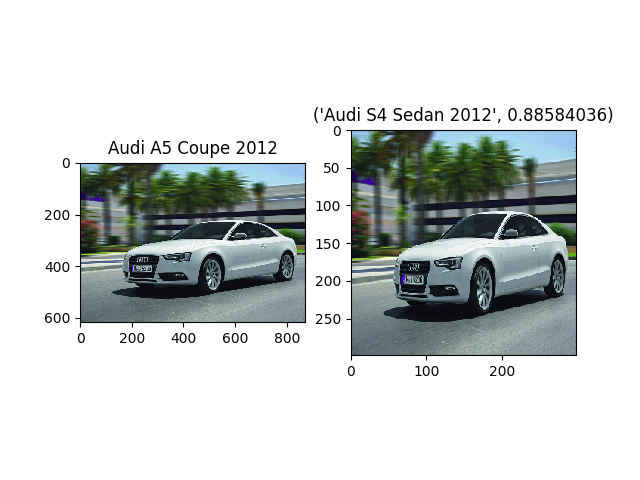
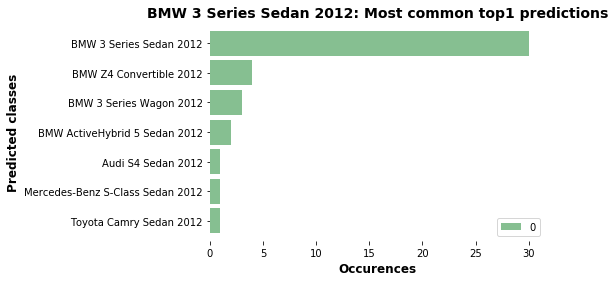

# cars-classification-deep-learning (IntelliGate project) 

**IntelliGate project** is aimed to create a system for an entrance gate which is able to fully recognize an approaching car. Car recognition involves recognition of a make and model of a car exploiting its shape (1), company logo recognition (2) reading and interpretation of number plate of a car. (3).

This repository contains files and description concerning the (1) part of the project: **recognition of a make and model of a car**.

The classification algorithm was created by transfer learning and fine-tuning Inception-v3 network [1] [2] with Cars Dataset from Stanford [3]. Keras implementation of Inception-v3 was used [4].
Final model is able to recognize 195 different classes of cars with overall accuracy of 81%. 
The class name (label) contains name of company, model, type and year of production, e.g.: “BMW M3 coupe 2012”.

## Prerequisites

In order to use the classification algorithm as well as train a new model with usage of my code, you have to install Python 3.6 and additional packages. For training purposes, a machine with GPU is recommended. 
Dependencies:

- [NumPy](http://docs.scipy.org/doc/numpy-1.10.1/user/install.html)
- [Tensorflow](https://www.tensorflow.org/versions/r0.8/get_started/os_setup.html)
- [Keras](https://keras.io/#installation)
- [OpenCV](https://opencv-python-tutroals.readthedocs.io/en/latest/)
- [Matplotlib](https://matplotlib.org/)
- [Jupyter Notebook](https://jupyter.org/)
- [Pillow](https://pypi.org/project/Pillow/2.2.2/)
- [Scikit-learn](https://scikit-learn.org/stable/)


## Usage

Download or clone whole repository in order to obtain all necessary files. If you need a dataset - you can download it from [here.](https://drive.google.com/drive/u/1/folders/1KfR5TjGstcA3SEXb2TKkHnoTVIoiCKDG)
Save it inside the project folder (DATASETS/). 

### Use a classification algorithm 

Use the *demo.py* file in order to test an algorithm. 

Warning: the default RESULTS_FOLDER in the code leads to the *cars-classification-deep-learning/saved_models/20190701_1148* which does not contain file with weights. You can download weights from [here](https://drive.google.com/drive/folders/1HXAJUELObpp06H9VGNmopPiBopmHGjkb?usp=sharing) (*weights.best.hdf5*), save it inside results folder (*saved_models/20190701_1148*) and run the *demo.py*. 

Example usage:

#### a) give a full path for image and its correct class

```bash
python3 demo.py 'Tesla Model S Sedan 2012' '../test_imgs/tesla.png'
```
Output:




[[('Tesla Model S Sedan 2012', 0.99994814), ('Aston Martin V8 Vantage Coupe 2012', 9.0942467e-06), ('Hyundai Veloster Hatchback 2012', 6.253455e-06), ('Volkswagen Golf Hatchback 2012', 3.5931739e-06), ('Acura ZDX Hatchback 2012',2.7549402e-06)]]

#### b) random choice of image from dataset of given class

```bash
python3 demo.py 'Audi A5 Coupe 2012'
```

Output:




[[('Audi S4 Sedan 2012', 0.88584036), ('Audi A5 Coupe 2012', 0.11131641), ('Audi TTS Coupe 2012', 0.0016650328), ('Audi S6 Sedan 2011', 0.00045785238), ('Audi S4Sedan 2007', 8.3126331e-05)]]

In order to use a different test dataset that the one which is hardcoded inside the code, specify the path as a last argument:

```bash
python3 demo.py 'Volkswagen Golf Hatchback 2012' "../saved_models/BEST_OF_THE_BEST/all_layers_trained_lhcbgpu_inceptionv3_RESIZEDIMGS/20190626_0944"
```

There is also  version for Jupyer Notebook. There are similar options of usage. Examples:


### Train your own model

#### 1. Prepare a dataset

##### a) use Stanford Dataset

The main folder should contain 2 subfolders: train dataset and test dataset. Each of them should contain more subdirectories created due to class (label) names (one subdirectory per class).
You can prepare data on your own, using [original Cars Stanford Dataset](https://ai.stanford.edu/~jkrause/cars/car_dataset.html) or use mine (already sorted) - download from [here.](https://ai.stanford.edu/~jkrause/cars/car_dataset.html)

If you want to modify these images (resize, expand background, transform to grayscale) you can check functions inside the script called *data_preprocessing.py*.

##### b) use a new dataset
If you want to use a new dataset, you also need to prepare them: save images inside correct subdirectories.

#### 2.  Modify the *hyperparams.json* 

Modify the *hyperparams.json* file in order to adjust hyperparameters and other training settings. 

WEIGHTS - initial weights

EPOCHS - number of epochs to train

BATCHSIZE - number of training batch

LEARN_RATE - learning rate

DROPOUT - dropout

TRAIN_LAYERS - specifies number of trainable layers. Set to 0 in order to train only classificator; set “all” if you want to train all layers. In order to set x last layers of network as trainable - set this hyperparameter to “x”.

FC_LAYERS - shape of fully connected layers in classificator

#### 3. Check paths

Check paths that are hardcoded inside the script, which leads to:
- datasets (TRAIN_DIR, TEST_DIR)
- file with settings: *hyperparams.json*
- directory for results (RESULTS_FOLDER; default: *saved_models/*) 

#### 4. Run:

```bash
python3 train.py 
```
#### 5. The folder with results 

The folder with results (weights, structure of model, plots of accuracy in the function of epochs etc) will be automatically saved inside the folder *saved_models/xxxxxxxx_xxxx*. (*xxxxxxxx_xxxx* - the data and hour of starting the training).
Depending on number of data and computational power of you machine, the training process can last from few hours to few days. (Stanford Datasat, GPU ~ 24 hours).

### Analyse results

In order to analyse the results (confusion matrix, accuracy within each of the class and more statistics concerning model performance) *use analyse_results.ipynb*. Specify the paths:
- datasets (TRAIN_DIR, TEST_DIR)
- file with settings: *hyperparams.json*
- directory with results (RESULTS_FOLDER; default: *saved_models/20190701_1148*)

Example statistics created with *analyse_results.ipynb* (for BMW 3 Series Sedan 2012):




## Bibliography

[1] Rethinking the Inception Architecture for Computer Vision -  https://arxiv.org/pdf/1512.00567v1.pdf

[2] Medium – Review: Inception-v3 — 1st Runner Up (Image Classification) in ILSVRC 2015- https://medium.com/@sh.tsang/review-inception-v3-1st-runner-up-image-classification-in-ilsvrc-2015-17915421f77c

[3] AI Stanford – Car Dataset - https://ai.stanford.edu/~jkrause/cars/car_dataset.html

[4] Keras Documentation - Inception-v3 - https://keras.io/applications/#inceptionv3

